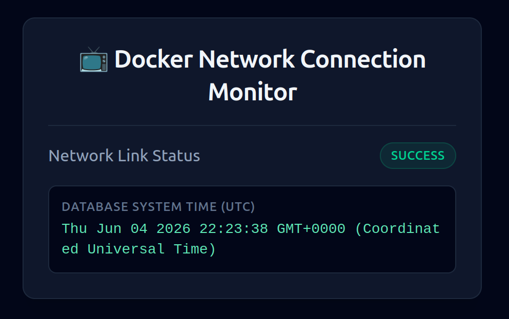

# 🗓️ Full-Stack Meeting Scheduler Engine

A robust, self-hosted meeting scheduling application built from scratch. This engine utilizes Next.js Server Actions for secure backend computing and interfaces directly with a native local PostgreSQL instance for transaction-safe scheduling architecture.

## 📐 System Runtime & Architecture

This project strictly pins dependencies and runtimes to guarantee architectural reproducibility across environments.

* **Runtime Version Manager:** `asdf` v0.18.1 (revision 6a97697)
* **Backend Environment:** Node.js v24.14.0
* **Database Engine:** PostgreSQL v18.1
* **Core Framework:** Next.js v14.2.3 (App Router Architecture)
* **Database Driver:** Native `pg` connection pool client

## 👺 Defensive Architecture Highlights

* **Absolute Path Resolution:** The data migration utility leverages Node's native `path` module to guarantee precise `.env.local` context target parsing regardless of the caller execution directory.
* **Transaction-Safe Seeding:** Database table configuration and initial data injections are wrapped inside strict SQL `BEGIN`/`COMMIT` wrappers to prevent partial database pollution if an initialization failure occurs.


## 📂 Project Structure

```text
scheduler-app/
├── .tool-versions          # Pinned system runtime versions via asdf
├── .env.local              # Local environment infrastructure secrets (Git ignored)
├── package.json            # Strict dependency locks
├── scripts/
│   └── migrate.js          # Standalone schema initialization & data seed transaction
└── src/
    ├── app/                # Next.js UI Routes & Pages
    ├── lib/
    │   └── db.ts           # PostgreSQL client pool configuration
    └── actions/
        └── bookings.ts     # Core server-side scheduling logic & validation

```

## 🥽 Local Infrastructure & Development Setup

This application is fully containerized using Docker to eliminate environment drift ("works on my machine" syndrome) and make onboarding seamless.

---

### 📋 Prerequisites

Before choosing a setup track, ensure you have these core tools installed on your host system:
* **Git**
* **Docker & Docker Compose**

---

### 🚀 Quickstart with Docker 
This setup spins up the entire ecosystem—the Next.js frontend, Turbopack compiler, and PostgreSQL database engine—inside isolated containers using a single unified terminal setup.

#### ***1. Clone the Project***
```bash
git clone <PASTE_YOUR_COPIED_GITHUB_URL_HERE>
cd scheduler-app

```

#### ***2. Configure Environment Variables***

Create a file named `.env.local` in the project root directory and paste the following internal connection string:

```env
# Database Connection String (Routed via internal Docker bridge network DNS)
DATABASE_URL=postgresql://postgres:postgres_secure_dev_pass@db:5432/scheduler_db

```

#### ***3. Build & Compile Container Images***

Download the slim Alpine base environments and install project dependencies cleanly inside the container sandbox layers:

```bash
docker compose build --no-cache

```

#### ***4. Boot the Infrastructure Stack***

Launch the Next.js app engine and the PostgreSQL 18 database service together:

```bash
docker compose up

```

* 🌐 **Frontend Application UI:** Access the running server at [http://localhost:3000](https://www.google.com/search?q=http://localhost:3000)
* 🐘 **Database Port Engine:** Listens internally and forwards isolated traffic securely on port `5432`

#### ***5. Execute Database Migrations & Seeding***

Open a second terminal window while the container stack is active, and run the migration script inside the live container context to build your schemas and inject test datasets:

```bash
docker compose exec web npm run db:migrate

```

#### ***6. Verify Database Connectivity***

Open your web browser and navigate to [http://localhost:3000/test-db](https://www.google.com/search?q=http://localhost:3000/test-db) to run an automated server-side internal connection sanity test. If connected properly, you will see a green **Success** badge displaying the current live database timestamp.


##### Database Infrastucture Verification
Below is a confirmation of the local runtime connection pool validating successful communication with the containerized POstgreSQL database: 




#### ***7. Tearing Down the Infrastructure***

To stop the application containers cleanly and clear out temporary runtime layers:

```bash
docker compose down

```

> 💡 **Pro-Tip:** To completely flush anonymous dependency caches and start from absolute zero on your next run, append the volume flag: `docker compose down -v`


## 🔍 License
Source code is visible for review and portfolio purposes only. Commercial use requires a paid license.